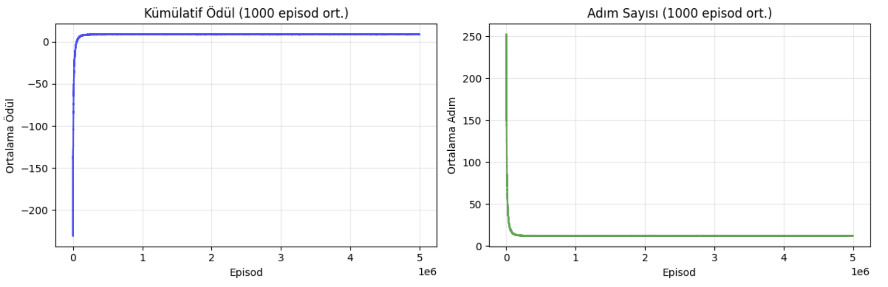
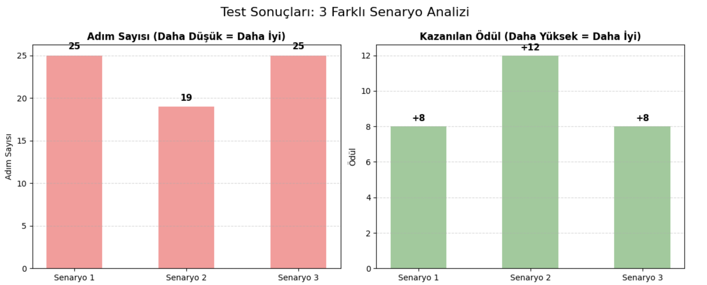
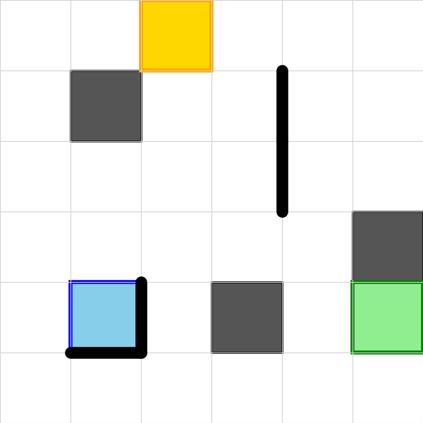

# 6×6 Taxi - Q-Learning Projesi

Derste incelediğimiz [Taxi-env](https://github.com/woutervanheeswijk/taxi_environment/blob/main/taxi_q_learning.ipynb) projesinden ve kodlarından yola çıkarak kendi ortamımı (environment) oluşturdum ve aynı kod akışını kullanarak bir proje geliştirdim. Kodlarımı Jupyter Notebook üzerinde yazmayı tercih ettim. Bu sayede süreci adım adım izleyebildim ve çıktıların kayıtlı kalmasını sağladım.

## 1. Giriş

Bu çalışmada 6×6 boyutunda bir ızgara (grid) kullandım. Haritaya 3 adet geçersiz kare ve 4 adet duvar ekledim. Benim projemde taksi, haritadaki her noktadan yolcu alıp bırakabiliyor. Action Mask tekniğini kullandığım projede toplamda **47.952** adet durum (state) bulunuyor. 5 milyon episode süren eğitim sonucunda ajan, ortalama 12 adımda ortalama 8.99 ödül elde etmeyi başardı.

## 2. Ortam Tasarımı

### Harita Özellikleri

Tasarladığım harita yapısını ve engelleri aşağıdaki gibi kurguladım:
```text
+------------------+
| .  .  .  .  .  . |
| .  X  .  |  .  . |  
| .  .  .  |  .  . | 
| .  .  .  .  .  X |
| .  _| .  X  .  . |  
| .  .  .  .  .  . |
+------------------+
```

**Boyut:** 6×6'lık bir ızgara (grid) yapısı kullandım.

**Engeller:** Ortama 3 adet yasak hücre ve 4 adet sabit duvar ekledim.

**Dinamik Yapı:** Her reset işleminde yolcu ve hedef konumları rastgele belirleniyor.

**Esneklik:** Taksi, haritadaki tüm geçerli hücrelerden yolcu alıp (pickup) bırakabiliyor (dropoff).

**Action Masking:** Ajanın duvara çarpmasını veya boş yerde yolcu almaya çalışmasını engellemek için action masking yöntemini kullandım.

### Aksiyonlar (6 Adet)

Ajanın yapabileceği hamleleri şu şekilde tanımladım:

- Yukarı
- Aşağı
- Sol
- Sağ
- Pickup (Yolcu Alma)
- Dropoff (Yolcu Bırakma)

### Ödül Mekanizması

Öğrenmeyi teşvik etmek için ödülleri şöyle ayarladım:

- **Normal adım:** -1 (En kısa yolu bulması için)
- **Geçersiz hareket:** -10 (Kurallara uyması için)
- **Başarılı bırakma:** +20 (Hedefe ulaştığında)

## 3. Durum Uzayı (State Space)

Durum uzayını hesaplarken önemli bir optimizasyon yaptım. Yolcu taksinin içindeyken ayrıca bir yolcu konumu tutmaya gerek olmadığı için, olası durum sayısını 622.080'den 47.952'ye düşürdüm.

Hesaplamayı şu mantıkla yaptım:

- **Taksi:** 36 olası konum (6×6)
- **Hedef:** 36 olası konum (6×6)
- **Yolcu:** Beklerken 36 konum, taksideyken 1 durum

**Detaylı Hesabım:**

**Yolcu Dışarıdayken (Bekliyor):**
(Taksi 36) × (Yolcu 36) × (Hedef 36) = 46.656 durum

**Yolcu Taksideyken:**
(Taksi 36) × (Hedef 36) = 1.296 durum (Yolcu konumu önemsiz)

**Toplam:** 46.656 + 1.296 = **47.952 Durum**

Bu sadeleştirme sayesinde durum uzayını yaklaşık 13 kat küçültmüş oldum.

## 4. Yöntem

Projeyi hayata geçirirken izlediğim yöntem ve belirlediğim parametreler şunlardır:

- **Algoritma:** Problem çözümü için **Q-Learning** algoritmasını kullandım.
- **Hiperparametreler:**
  - **Öğrenme Oranı (α):** 0.1
  - **İndirim Faktörü (γ):** 1.0 (Gelecek ödüllere tam önem verdim)
  - **Keşif Oranı (ε):** 0.1
- **Eğitim Süreci:**
  - Toplamda **5.000.000 episod** boyunca eğitim gerçekleştirdim.
  - Gelişimi takip edebilmek adına her 50.000 episodda bir performans değerlendirmesi yaptım.
  - Ajanın mantıksız hamleler yapmasını önlemek için **Action Masking** yöntemini eğitimin her aşamasında aktif tuttum.
- Elde ettiğim en başarılı politikayı (policy) **`best_q_table.npy`** dosyasına kaydederek sakladım.



## 5. Geliştirme Süreci

Projeyi 5 temel adımda kurguladım ve uyguladım:

### 5.1. Ortamı (Environment) Oluşturdum

İlk iş olarak oyunun dünyasını ve kurallarını tanımladım.

- **`__init__`:** Haritanın boyutlarını, engelleri ve hareket kurallarını burada belirledim.
- **`reset`:** Her yeni oyunda taksi, yolcu ve hedefi rastgele konumlara atayarak ortamı sıfırlayan fonksiyon.
- **`_get_obs`:** Ajanın karar verebilmesi için taksi ve yolcunun anlık koordinatlarını döndürüyor.
- **`_has_wall_between` & `_is_valid_move`:** Ajanın harita dışına çıkmasını veya duvardan geçmesini engelleyen fizik kontrolleri.
- **`_get_action_mask`:** Burası önemli; ajanın o an yapması imkansız olan (duvara çarpmak gibi) hamleleri filtreleyerek öğrenme sürecini optimize ettim.
- **`step` & `render`:** Ajanın hamlesini uygulayıp ödül hesapladığım ve oyun alanını görselleştirdiğim kısımlar.

### 5.2. State, Action ve Ortam Kontrollerini Sağladım

Kodun sağlıklı çalışıp çalışmadığını test etmek için bir doğrulama adımı ekledim.

- Ortamı başlatıp rastgele ama "geçerli" (Action Mask uygulanmış) hamleler yaptırdım.
- Böylece ödül mekanizmasının ve hareket kısıtlamalarının doğru işleyip işlemediğini teyit ettim.
- Ayrıca Q-tablosunda veriyi işleyebilmek adına, oyunun anlık durumunu (State) benzersiz bir sayıya çeviren `state_to_index` fonksiyonunu yazdım.

### 5.3. Rastgele Bir Episode Çalıştırıp Gözlemledim

Ajanın henüz hiçbir şey öğrenmeden ortamda nasıl davrandığını görmek istedim.

- **`run_random_episode`:** Ajan tamamen rastgele hamlelerle oyunu oynadı. Bu sırada hataları ve sistemin tepkilerini kaydettim.
- **`show_episode_animation`:** Kaydettiğim bu kareleri (frames) birleştirerek ajanın hareketlerini video olarak görselleştirdim.

### 5.4. Q-Learning Eğitimi Gerçekleştirdim

Ajanı Q-Learning algoritması ile eğittim:

- **Hazırlık:** Boş bir Q-Tablosu (hafıza) oluşturdum ve öğrenme parametrelerini (Learning Rate, Gamma vb.) ayarladım.
- **Eğitim Döngüsü:** Ajana oyunu tam 5 milyon kez oynattım.
- **Epsilon-Greedy:** Ajanın bazen rastgele keşif yapmasını (Exploration), bazen de bildiği en iyi hamleyi yapmasını (Exploitation) sağladım.
- **Kayıt:** Her 50.000 adımda bir performansı ölçtüm. Eğer ajan rekor kırarsa o anki modeli `best_q_table.npy` olarak kaydettim. Sonuçları da başarı grafikleriyle görselleştirdim.

### 5.5. Best Q-Table ile Test ve Değerlendirme

Son aşama.

- Kaydettiğim "en iyi modeli" yükleyerek ajanı 3 farklı senaryoda test ettim.
- Bu aşamada ajan artık keşif yapmadı, doğrudan öğrendiği en optimal hamleleri uyguladı.
- `store_episode_as_gif` ile bu başarılı turları GIF formatında kaydedip görselleştirdim.

## 6. Eğitim Sonuçları

Eğitim sürecinden elde ettiğim veriler aşağıdaki gibidir:

| Episod | Ortalama Ödül | Adım Sayısı |
|:---|:---|:---|
| 50.000 | –33.26 | 54.3 |
| 100.000 | +3.85 | 17.1 |
| 500.000 | +8.94 | 12.1 |
| 2.350.000 | +8.99 | 12.0 |
| 5.000.000 | +8.98 | 12.0 |

**Analiz:**

Sonuçları incelediğimde, ajanın yaklaşık **150.000** episod civarında görevi çözmeye başladığını gördüm. Performansın zirveye ulaştığı nokta ise **2.3 – 2.6 milyon** episod aralığı oldu.

Toplam eğitim süresi: **1 saat 8 dakika 49 saniye** sürdü.


## 7. Test Sonuçları

Eğittiğim modeli 3 farklı senaryoda test ettiğimde şu sonuçları aldım:

| Senaryo | Adım Sayısı | Ödül |
|:---|:---|:---|
| 1 | 25 | +8 |
| 2 | 19 | +12 |
| 3 | 25 | +8 |



**Değerlendirme:**

Test aşamasında ajanın **engellere hiç takılmadığını**, yasaklı hücrelere girmediğini ve hedefe giderken **optimuma en yakın rotaları** tercih ederek görevi başarıyla tamamladığını gözlemledim.

**Test Episode Animasyonu:**

<p align="center">
  
</p>
